# Service Worker 实战

本文主要介绍 Service Worker 一些常用实战。通过本文可以了解到如下内容
- 离线体验
- 如何使用 DevTools 调试 Service Worker。
- 定制响应
- 如何优雅地更新 Service Worker
- 更新缓存
- fallback
- 一些验证
  - 为了什么`waitUtil()` 与 `reponseWith()` 能延长生命周期？
  - 为什么不能使用全局变量?


为了方便解说，这里以一个图片查看应用为例：[view-img]()。它的功能很简单：一个按钮，当单击按钮时，展示图片。
> singsong: 为了确保运行环境不受浏览器插件的影响，应用都运行在一个新的无痕窗口中。

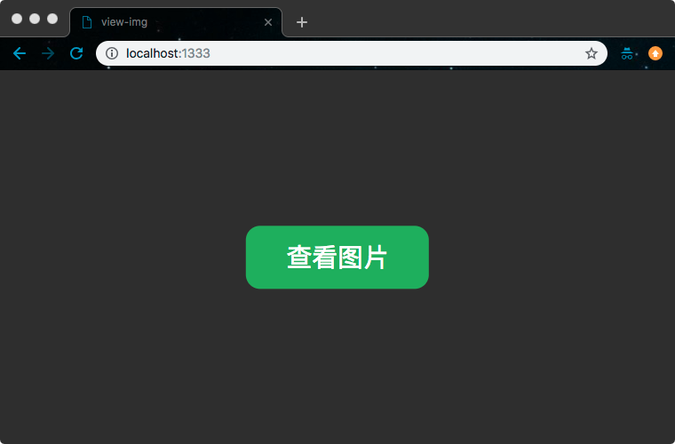

应用需要运行在一个本地服务上，为了节省开发成本，可以使用 [serve](https://github.com/zeit/serve)、[http-server](https://github.com/indexzero/http-server) 等工具库来提供一个本地静态服务。如果你电脑上安装了 **python**，也可以使用 [SimpleHTTPServer](https://docs.python.org/2/library/simplehttpserver.html)。

在没有网络的情况，访问应用，会得到如下页面：

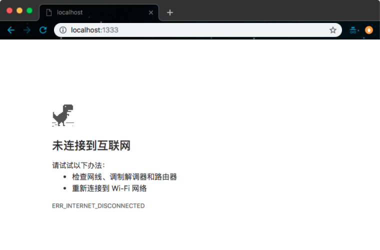

为了提高应用的用户体验，这里可以基于 Service Worker，为应用添加离线体验功能。

## 离线体验
使用 Service Worker 让应用支持离线体验，可以通过如下几个步骤来完成：

- 创建 Service Worker 脚本。
- 注册 Service Worker。
- 预缓存应用资源。
- 拦截请求。


### 创建 Service Worker 脚本

首先，在根目录下创建一个名为 `sw.js` 的 JavaScript 文件，并添加如下代码：

```js
console.log('Hello from sw.js') // 用于确定 sw.js 是否运行
```
### 注册 Service Worker。

在应用的 `app.js` 文件中添加注册代码：

```js
// app.js
if ('serviceWorker' in navigator) {
    navigator.serviceWorker
        .register('/sw.js')
        .then(() => { console.log("Service Worker Registered"); }); // 用于确定 Service Worker 已被注册
}
```

> singsong: 在代码中打印一些有效信息，用于确定当前状态。

#### 如何使用 DevTools 调试 Service Worker
在运行之前，先了解一下 Service Worker 调试工具。这里以 **Chrome** 为例讲解。按 `Command+Option+I (Mac)` 或 `Ctrl+Shift+I（Windows、Linux）`打开 **Chrome** 的 **DevTools**。切换到 Application 面板。该面板提供了查看、修改、调试 web app 的 Manifest、Service Workers, 及 Cache 的功能。

其中 Service Workers 项提供了3个辅助调试选项：

- Offline(Force disconntected from network)：离线。常用用于离线访问调试。
- Upadate on reload(Force update Service Worker on page reload)：页面重新加载时强制更新 Service Worker。在开发 Service Worker 时，为让 Service Worker 脚本文件的修改能及时生效，在调试时最好勾选上该项。
- Bypass for network(Bypass Service Worker and load resources from the network)：越过 Service Worker，从网络获取资源。常用用于模拟 Service Worker 不工作。

另外，Service Workers 项还收集了当前应用 Service Worker 的状态信息。因为此时应用还没有注册 Service Worker，所以面板没有任何信息。

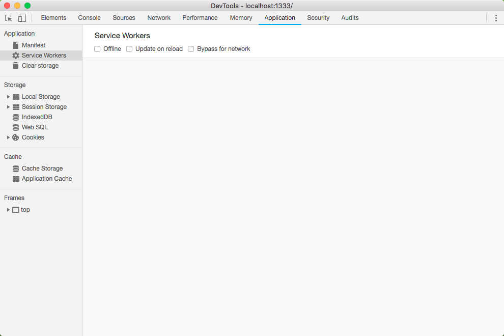

如果重新加载页面，就能看见当前应用 Service Worker 的相关信息：

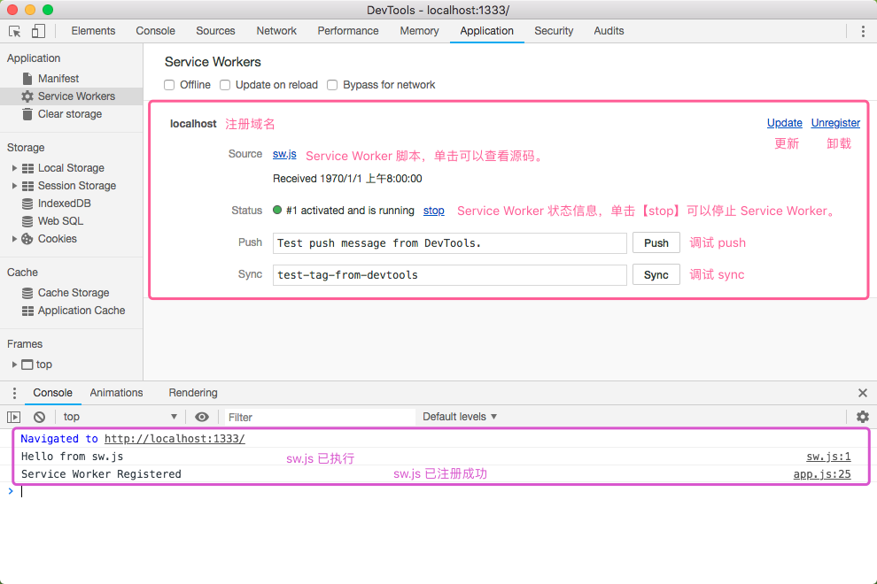

另外，需要注意的是：如果在想 `Console` 面板中查看当前 Service Worker 相关信息，需要确保 `Console` 是在当前 Service Worker 上下文中。

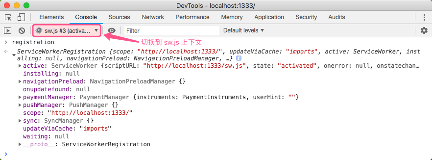


### 预缓存应用资源

上文已了解到，可以在 Service Worker 的 `install` 事件中对应用的静态资源进行预缓存处理。在 `sw.js` 文件中添加如下代码：

```js
// cache polyfill
importScripts('/cache-polyfill.js');
// version
const VERSION = 1;
// cache name
const CACHE_NAME = `view-img-static-v${VERSION}`;

// install
self.addEventListener('install', function(e) {
  e.waitUntil(
    caches.open(CACHE_NAME).then(function(cache) {
      return cache.addAll([
        '/',
        '/index.html',
        '/styles/app.css',
        '/scripts/app.js',
        '/images/wolf.jpg'
      ]);
    })
  );
});
```
> singsong: 在 `cache.addAll()` 指定的缓存资源中，`'/'` 与 `'/index.html'` 是等效的。
`importScripts('/cache-polyfill.js');`是对 [Cache API](https://developer.mozilla.org/en-US/docs/Web/API/Cache) 一个补丁。因为不是所有浏览器都支持 Cache API。使用 `cache.addAll()` 方法添加指定资源到本地缓存中。需要注意的是，`cache.addAll()` 任何文件缓存失败都会导致 `cache.addAll()` 操作失败。另外，这里在缓存命名时使用了版本号 `VERSION`，主要是为了方便维护缓存。

在重新运行页面之前。为了让 `sw.js` 的修改能及时生效，可以在`Service Workers`调试面板中（**Chrome** -> **DevTools** -> **Application** ）勾选【Upadate on reload】选框。重新加载页面，然后使用 **DevTools** 查看资源是否成功缓存。

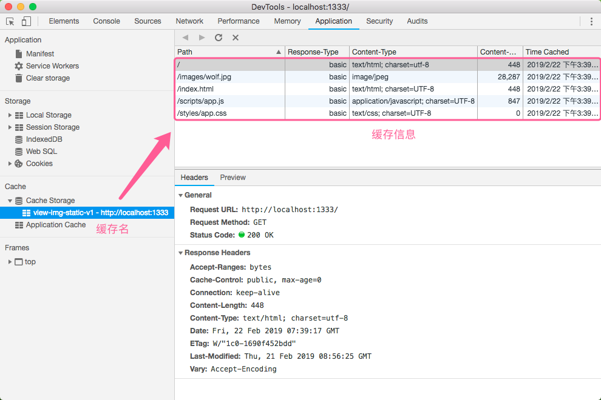

从上图可以清楚地看见，资源已成功缓存在本地。另外，还可以通过网络请求做进一步确认。

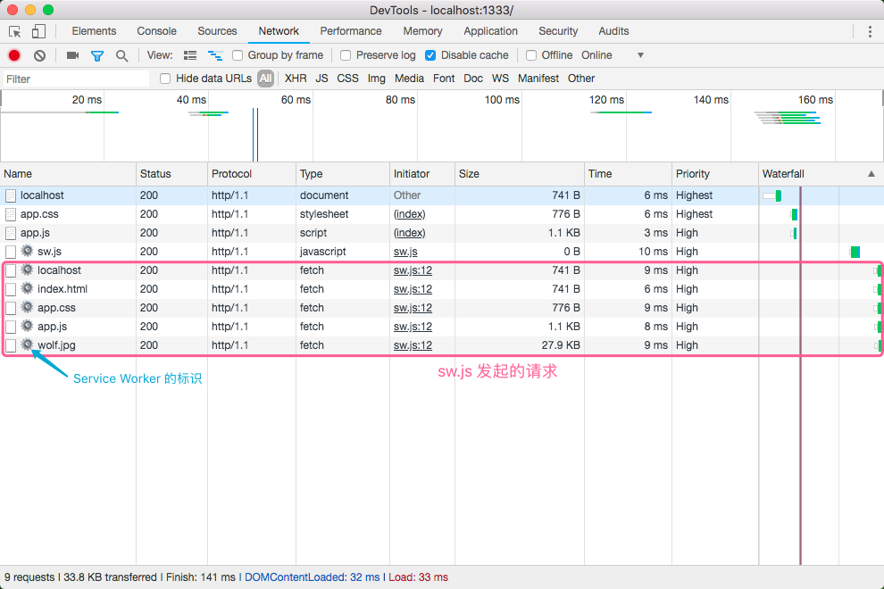


到此资源已准备好。最后就差将网络请求拦截，然后从 `Cache` 获取资源响应请求。

#### self.clients.claim()

为了确保刚激活的 Service Worker 能控制在当前 Service Worker 作用范围内的所有页面，包括在 Service Worker 激活之前已加载的页面。可以在 Service Worker 激活时调用 `self.clients.claim()` 方法。[更多详情……](https://stackoverflow.com/questions/41009167/what-is-the-use-of-self-clients-claim)

```js
self.addEventListener('activate', event => {
  event.waitUntil(self.clients.claim());
});
```

### 拦截请求

在 Service Worker 成功激活，并控制页面后。页面随后的请求都会经过 Service Worker，再通过 `fetch` 事件拦截这些请求。在 `sw.js` 中添加如下拦截代码：

```js
self.addEventListener('fetch', function (event) {
    event.respondWith(
        // 如果本地存在请求资源就直接响应，否则从网络获取。即缓存优先策略
        caches.match(event.request).then(function (response) {
            return response || fetch(event.request);
        })
    );
});
```
逻辑很简单：如果本地存在请求资源就直接响应，否则从网络获取。即缓存优先策略（Cache-first）。此时，如果代码没有任何问题，应用就可以支持离线访问了。为了能体验离线访问，需要开启 `offline` 模式，然后运行页面。

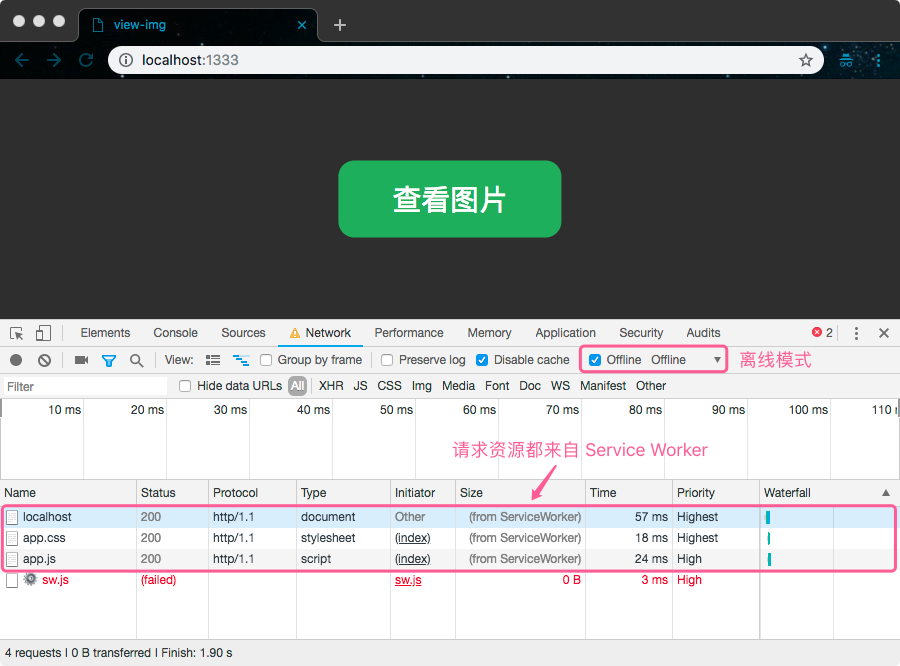

在离线模式下，页面请求都资源都来自当前的 Service Worker。接下来，单击【查看图片】按钮，验证查看图片是否能正常工作。

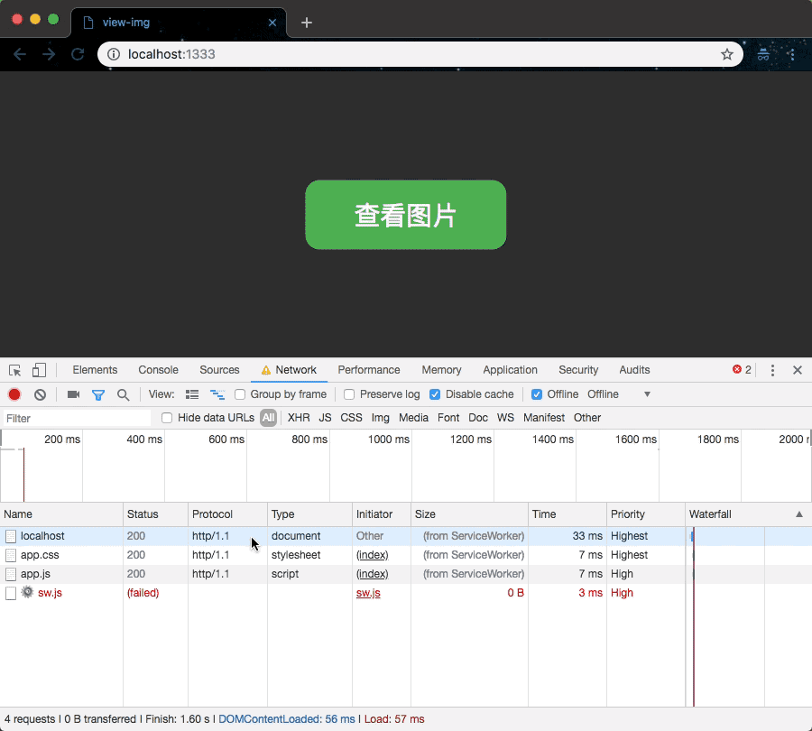

现在应用已具备了离线访问功能啦🤘

## 定制响应

如果有这样需求：在请求`'/images/wolf.jpg'`图片时，不响应`'/images/wolf.jpg'`而使用`'/images/husky.jpg'`作为响应。要实现该需求，首先需要对 `sw.js` 做如下调整。

- 将 `'/images/husky.jpg'` 缓存在本地

  ```js
  // install
  self.addEventListener('install', function(e) {
    e.waitUntil(
      caches.open(CACHE_NAME).then(function(cache) {
        return cache.addAll([
          '/',
          '/index.html',
          '/styles/app.css',
          '/scripts/app.js',
          '/images/wolf.jpg',
          '/images/husky.jpg', // 新增加
        ]);
      })
    );
  });
  ```
- 修改拦截请求逻辑

  ```js
  self.addEventListener('fetch', function (event) {
      // 获取请求
      let request = event.request;
      // 解析URL
      const url = new URL(request.url);

      // 如果请求的是'/images/wolf.jpg'，响应 '/images/husky.jpg'。
      if(url.origin === location.origin && url.pathname === '/images/wolf.jpg'){
          request = new Request('/images/husky.jpg');
      }

      event.respondWith(
          // 如果本地存在请求资源就直接响应，否则从网络获取。即缓存优先策略
          caches.match(request).then(function (response) {
              return response || fetch(request);
          })
      );
  });
  ```
重新运行页面，运行效果如下：

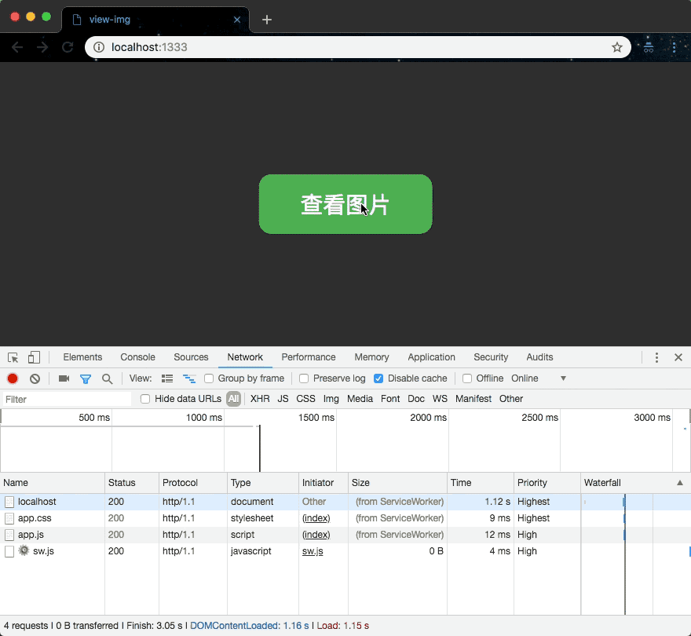


## 优雅更新 Service Worker

在开发 Service Worker 过程中，为了确保 `sw.js` 的修改能实时生效，需要开启【Upadate on reload】选项。如果不开启【Upadate on reload】选项会怎么样呢？

对 `sw.js` 做的任何修改，即使是一字节的变化，浏览器都会将 `sw.js` 视为新的 Service Worker 脚本。为了说明问题，在 `sw.js` 增加一个注释，然后重新运行页面。但在重新运行页面之前，先将【Upadate on reload】关闭。运行效果如下：

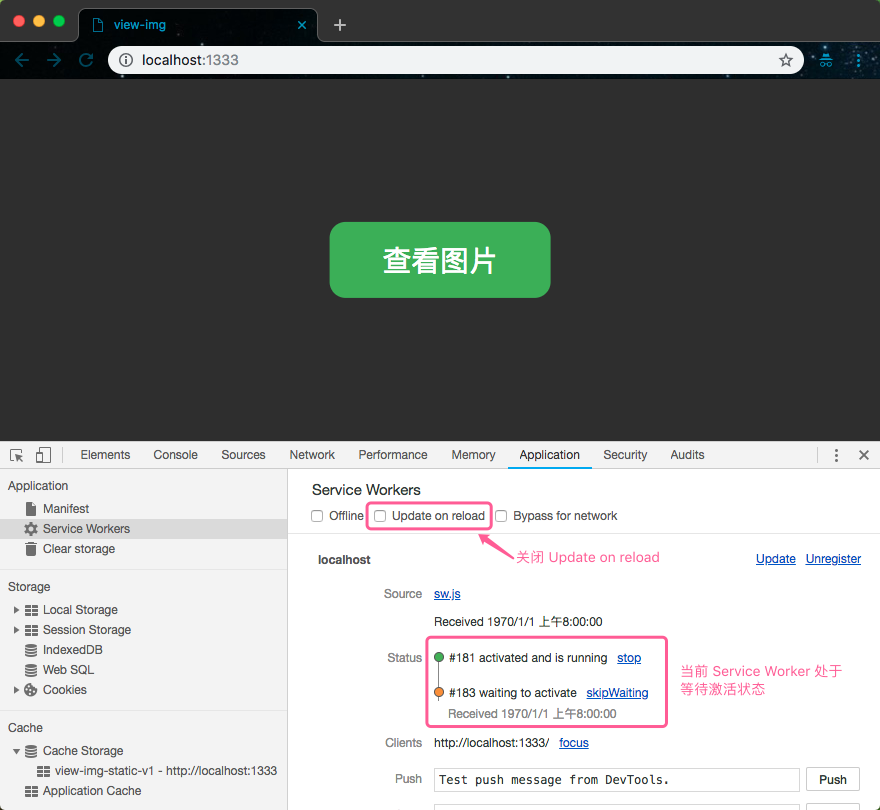

此时，旧的 Service Worker 还在运行，新的 Service Worker 需要等待旧的 Service Worker 被回收后才能被激活。

如何卸载掉旧的 Service Worker 呢？可以通过如下方式：

- 关闭在旧 Service Worker 作用范围内的 window 或 tab 项。
- 跳转到不在旧 Service Worker 作用范围内的页面。

其实就相当于重启操作。这可以让旧 Service Worker 失去对页面的控制，浏览器才能回收旧 Service Worker 所用的资源。

### `self.skipWaiting()`

如果不想重启应用，可以在 Service Worker 安装时，调用 `self.skipWaiting()` 方法，直接跳过`waiting`。

```js
// install
self.addEventListener('install', function(e) {
  // 跳过 waiting
  self.skipWaiting();
  // ...
});
```
虽然 `self.skipWaiting()` 能马上让新的 Service Worker 激活，但这样**可能**会导致数据不一致的问题。因为此时页面相当于被两个 Service Worker 控制：
  1. 在新的 Service Worker 激活之前是由旧的 Service Worker 控制页面。
  2. 在新的 Service Worker 成功激活后取代旧的 Service Worker 控制当前页面。

即有部分数据是由旧的 Service Worker 提供，另一部分数据由新的 Service Worker 提供。


为了说明问题，假如现在对 `'/images/wolf.jpg'` 请求的响应，做如下调整
```js
const customReponse = (cnt = `
        ┌─┐       ┌─┐
     ┌──┘ ┴───────┘ ┴──┐
     │                 │
     │       ───       │
     │  ─┬┘       └┬─  │
     │                 │
     │       ─┴─       │
     │                 │
     └───┐         ┌───┘
         │         │
         │         │ 神兽
         │         │
         │         └──────────────┐
         │                        │
         │                        ├─┐
         │                        ┌─┘
         │                        │
         └─┐  ┐  ┌───────┬──┐  ┌──┘
           │ ─┤ ─┤       │ ─┤ ─┤
           └──┴──┘       └──┴──┘
`, init = { headers: { 'Content-Type': 'text/plain' }, status: 200 }) => new Response(cnt, init);


self.addEventListener('fetch', async function (event) {
    // 获取请求
    let request = event.request;
    // 解析URL
    const url = new URL(request.url);
    // responseForRequest
    let responseForRequest;

    // 如果请求的是'/images/wolf.jpg'，响应 '/images/husky.jpg'。
    if(url.origin === location.origin && url.pathname === '/images/wolf.jpg'){
      responseForRequest = await customReponse();
      // 提供最新的 `app.js`
    } else {
      // 如果本地存在请求资源就直接响应，否则从网络获取。即缓存优先策略
      responseForRequest = await caches.match(request).then((response) => response || fetch(request));
    }
    event.respondWith(responseForRequest);
});
```

此时，当请求 `'/images/wolf.jpg'` 时，响应不再图片类型的数据，而是字符串类型的数据。更新 `app.js` 让其支持处理字符串类型的数据。因为 `app.js` 已更新，最后还需要更新缓存。

```js
/* sw.js */
// version
const VERSION = 2;
// cache name
const CACHE_NAME = `view-img-static-v${VERSION}`;

// install
self.addEventListener('install', function(e) {
  e.waitUntil(
    caches.open(CACHE_NAME).then(function(cache) {
      return cache.addAll([
        '/',
        '/index.html',
        '/styles/app.css',
        '/scripts/app.js', // 更新
        '/images/wolf.jpg',
        '/images/husky.jpg',
      ]);
    })
  );
});

// activate
self.addEventListener('activate', (event) => {
  event.waitUntil(
    // 获取所有的缓存名
    caches.keys().then((cacheNames) => {
      return Promise.all(
        // 过滤需要删除的缓存名
        cacheNames
          .filter((cacheName) => {
            return cacheName != currentCacheName;
          })
          .map((cacheName) => {
            // 删除
            return caches.delete(cacheName);
          })
      );
    })
  );
});
```
首先需要安装新版本的缓存，然后在删除旧版的缓存。只需更新 `VERSION` 版本号，再在激活事件处理删除旧版的缓存。


当使用 `self.skipWaiting()` 强制更新 Service Worker 后。在单击【查看图片】时，可能得不到预期的效果。因为如果在新的 Service Worker 激活之前 `app.js` 请求已发起，即获取的 `app.js` 不是最新的，它是由旧的 Service Worker 提供的。它是不能处理字符串类型的数据。反之如果 `app.js` 请求在新的 Service Worker 激活之后在发起，就没任何问题了。

### `self.skipWaiting()` + 刷新

如果在新的 Service Worker 激活之后立即刷新页面，就能避免数据不一致的问题。可以在 `app.js` 添加如下代码：

```js
const isRefreshing = false; // 确保只刷新一次
navigator.serviceWorker.addEventListener('controllerchange',() => {
    if (isRefreshing) return;
    isRefreshing = true;
    window.location.reload();
  }
);
```
在页面被新的 Service Worker 控制时，会触发 `'controllerchange'` 事件。此时只需在 `'controllerchange'` 事件处理函数执行刷新操作即可。

但这样也会存在一个问题，如果用户正在填写表单。在即将填写完时，Service Worker 刚好更新完执行了刷新操作。这就可能导致用户填写的数据丢失。那该如何破呢？

### 由用户决定是否更新

秉着 *一切以用户为中心* 的原则，是否要更新 Service Worker 应该由用户来决定。当有 Service Worker 更新时，可以发送一个消息告知用户是否要更新。

对 `app.js` 做如下修改：
```js
// app.js
if ('serviceWorker' in navigator) {
  const listenForWaitingServiceWorker = (registration, callback) => {
    const awaitStateChange = () => {
      registration.installing.addEventListener('statechange', () => {
        if (this.state === 'installed') callback(registration);
      });
    }
    if (!registration) return;
    if (registration.waiting) return callback(registration);
    if (registration.installing) awaitStateChange();
    registration.addEventListener('updatefound', awaitStateChange);
  }
  const promptUserToRefresh = (registration) => {
    if (window.confirm('有个最新的版本是否要更新?')) {
      registration.waiting.postMessage({ action: 'skipWaiting' });
    }
  }

  navigator.serviceWorker.register('/sw.js').then((registration) => {
        listenForWaitingServiceWorker(registration, promptUserToRefresh);
      });

  const isRefreshing = false; // 确保只刷新一次
  navigator.serviceWorker.addEventListener('controllerchange', () => {
      if (isRefreshing) return;
      isRefreshing = true;
      window.location.reload();
    }
  );
}
```
在 `registration.installing` 获得一个新的 Service Worker 时，会触发 `'updatefound'` 事件，可以在该事件中对 `registration.installing` 的状态进行监听，当状态变为 `'installed'` 时。通知用户有新的版本可以更新。当用户确定更新后，就向 `sw.js` 发送 `{ action: 'skipWaiting' }` 消息。

```js
self.addEventListener('message', (event) => {
  if (event.data.action === 'skipWaiting') {
    self.skipWaiting();
  }
});
```
在 `sw.js` 接受到消息后，会执行 `self.skipWaiting()`。在页面被新的 Service Worker 控制时，会触发 `'controllerchange'` 事件执行刷新操作。


## fallback

在 Service Worker 控制页面后，在离线模式下，可以对没缓存的请求做回退方案（fallback）处理。为了讲解方便，这里只对没有缓存的页面请求做 fallback 处理。在 [view-img]() 应用新增一个 `fallback.html` 页面作为 fallback。当访问没有缓存的页面时，就将 `fallback.html` 作为响应返回。

```js
/* sw.js */
// version
const VERSION = 3;
// cache name
const CACHE_NAME = `view-img-static-v${VERSION}`;

// install
self.addEventListener('install', function (e) {
    e.waitUntil(
        caches.open(CACHE_NAME).then(function (cache) {
            return cache.addAll([
                '/',
                '/index.html',
                '/fallback.html',
                '/styles/app.css',
                '/scripts/app.js',
                '/images/husky.jpg',
                '/images/wolf.jpg',
                '/images/fallback.jpeg',
            ]);
        })
    );
});

// inercept
self.addEventListener('fetch', function (event) {
    // 获取请求
    let request = event.request;
    // 解析URL
    const url = new URL(request.url);
    // 如果请求的是'/images/wolf.jpg'，响应 '/images/husky.jpg'。
    if(url.origin === location.origin && url.pathname === '/images/wolf.jpg'){
        request = new Request('/images/husky.jpg');
    }

    event.respondWith(
        // 如果本地存在请求资源就直接响应，否则从网络获取。即缓存优先策略
        caches.match(request).then(async (response) => {
            return response || fetch(request).then((res, rej) => {
                // 处理fetch对某些400,500错误不会reject
                if(res.status >= 400){
                    rej(`${res.status}-${res.statusText}`);
                }
                return r;
            }).catch((error) => {
                // fallback
                if ( event.request.mode === 'navigate' || req.method === 'GET' && req.headers.get('accept').includes('text/html')) {
                    return caches.match('/fallback.html');
                }
                throw error;
            })
        })
    );
});
```
因为 fetch 对某些400，500错误不会 reject，所以这里对 `res.status >= 400` 做了过滤处理。在错误处理时，还需要对文档类型请求做过滤处理。当然在实际开发项目中，可以对不同的类型做不同 fallback 处理。

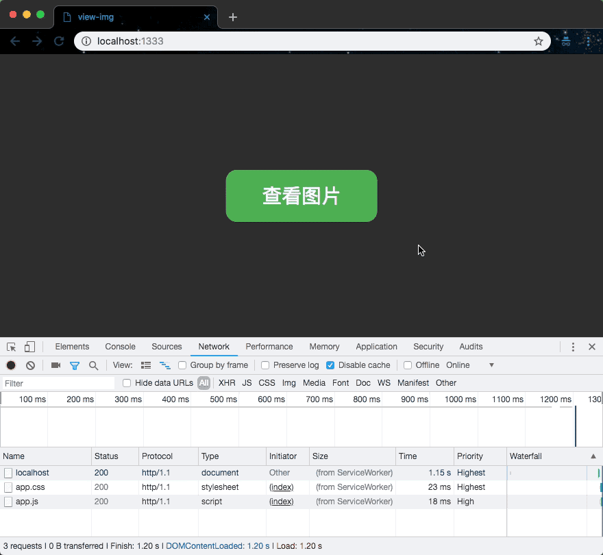

开启离线模式，随便访问一个没有缓存的页面。这里访问 `/test.html`，但得到却是 `fallback.html`。

## 一些验证

### 为了什么`waitUtil()` 与 `reponseWith()` 能延长生命周期？

为验证这个问题，首先需要一个模拟异步操作的方法。

```js
const delay = (delay, name) => {
    console.log(`${name}-delay start`); // delay start
    return new Promise(r => setTimeout(() => {
      console.log(`${name}-delay:`, delay); // delay end
      r();
    }, delay))
  };
```
这里通过在`install`事件中是否调用`waitUtil()`方法进行对比验证。并打印一些有效信息用于判断执行进度。
```js
// version
const VERSION = 1;
// cache name
const CACHE_NAME = `view-img-static-v${VERSION}`;

// install.
self.addEventListener('install', function (e) {
    console.log('******* install-event install *******'); // install event
    self.skipWaiting();
    delay(6000, 'waitUntil').then(r => caches.open(CACHE_NAME).then(function (cache) {
        console.log('cache start'); // cache start
        return cache.addAll([
            '/',
            '/index.html',
            '/styles/app.css',
            '/scripts/app.js',
            '/images/husky.jpg',
            '/images/wolf.jpg',
        ]);
    }).then((r) => {
        console.log('cache end'); // cache end
        return r;
      })
  )
});

// activate
self.addEventListener('activate', event => {
    console.log('******* install-event activate *******'); // activate event
});
```
运行输出：


从打印信息可知，`install` 事件并不会等待 `delay()` 方法执行完再执行 `activate` 事件。如果使用 `waitUtil()`，打印结果会怎样呢？

```js
// install.
self.addEventListener('install', function (e) {
  console.log('******* install-event install *******'); // install event
  self.skipWaiting();
  waitUtil( // 增加 waitUtil
    delay(6000, 'waitUntil').then(r => caches.open(CACHE_NAME).then(function (cache) {
        console.log('cache start'); // cache start
        return cache.addAll([
            '/',
            '/index.html',
            '/styles/app.css',
            '/scripts/app.js',
            '/images/husky.jpg',
            '/images/wolf.jpg',
        ]);
    }).then((r) => {
        console.log('cache end'); // cache end
        return r;
      })
    )
  );
});
```
运行输出：

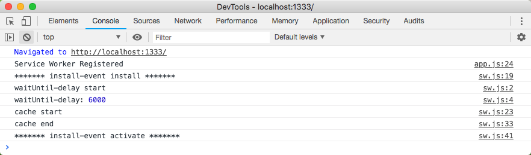

从打印信息可以清楚地知道，通过使用 `waitUtil()` 延长了 `install` 事件的生命周期，会等待 `cache.addAll()` 缓存操作完成后，再执行 `activate` 事件。

### 为什么不能依赖全局变量

由于基于事件驱动设计的 Service Worker 会频繁地重启，所以不能依赖全局变量(global state)在事件处理函数之间共享状态。因为每次 Service Worker 重启都会重新初始化全局状态。为了验证这个问题，对代码做一些调整：

> singsong：要验证这个问题，不能开启 DevTools，因为 DevTools 会保持对当前 Service Worker 的引用，导致浏览器不能回收 Service Worker。[更多详情……](https://stackoverflow.com/questions/29741922/prevent-service-worker-from-automatically-stopping)


```js
// 广播消息
const broadcast = (msg) => {
  self.clients.matchAll().then(clients => {
      if (clients && clients.length) {
      clients.forEach((client) => {
          client.postMessage(msg.join(', '));
      })
      }
  })
}

// version
const VERSION = 1;
// cache name
const CACHE_NAME = `view-img-static-v${VERSION}`;
// global variable
const variables = [];

// install.
self.addEventListener('install', function (e) {
    variables.push('install-event install');  // 填充 variables
    self.skipWaiting();// 每次只能运行一个sw版本
    e.waitUntil(
        caches.open(CACHE_NAME).then(function (cache) {
            return cache.addAll([
                '/',
                '/index.html',
                '/styles/app.css',
                '/scripts/app.js',
                '/images/husky.jpg',
                '/images/fox.jpg',
                '/images/husky2.jpg',
                '/images/wolf.jpg',
            ]);
        }).then((r) => {
            return r;
          })
    );
});

// activate
self.addEventListener('activate', event => {
  variables.push('install-event activate'); // 填充 variables
  event.waitUntil(clients.claim());
});

// inercept
self.addEventListener('fetch', function (event) {
    // 获取请求
    let request = event.request;
    // 解析URL
    const url = new URL(request.url);

    variables.push(url); // 填充 variables

    event.respondWith(
        // 如果本地存在请求资源就直接响应，否则从网络获取。即缓存优先策略
        caches.match(request).then(function (response) {
            broadcast(variables); // 广播 variables
            return response || fetch(request);
        })
    );
});
```
在 `sw.js` 增加一个全局变量 `variables`，并在`install`、`activate`、`fetch`事件中向 `variables` 变量中填充相关信息。并在 `fetch` 事件中，通过 [Channel Messaging API](https://flaviocopes.com/channel-messaging-api/) 向客户端发送 `variables` 信息。在客户端接受到 `variables` 将打印到页面中 `textarea`。所以还需要再客户端代码中增加如下代码，用于监听 Service Worker 发来消息。

```js
// 时间戳信息
const timeStamp = () => {
    const date = new Date();
    return [date.getHours(), date.getMinutes(), date.getSeconds()].join(':')
}
const txtarea = document.querySelector('.txtarea');
// 监听 Service Worker 发来消息
navigator.serviceWorker.addEventListener('message', function (e) {
    txtarea.value = txtarea.value + timeStamp() + '\n' + e.data + '\n\n';
    });
```

运行效果：

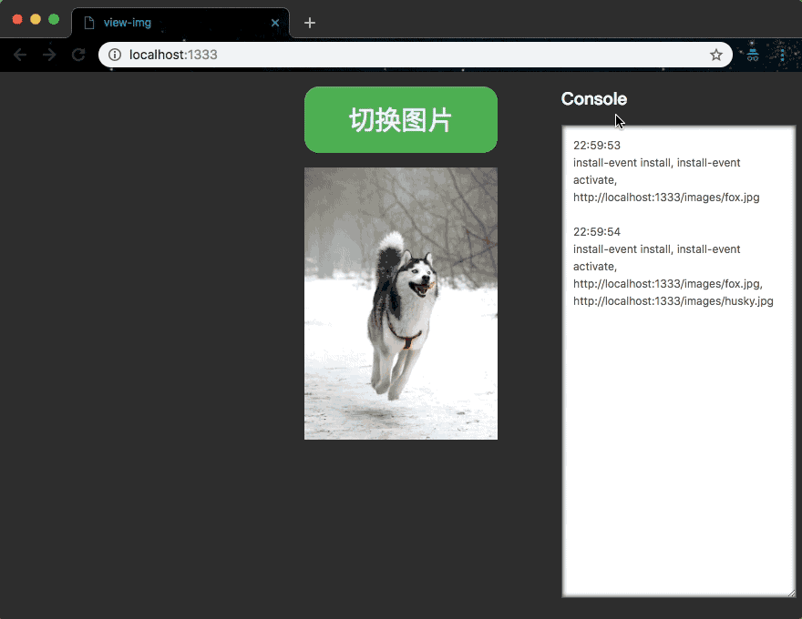

隔段时间，再单击【切换图片】。注意在【23:1:36】之后打印出的信息，并未接着之前的信息一起打印，说明之前 `variables` 信息已丢失。