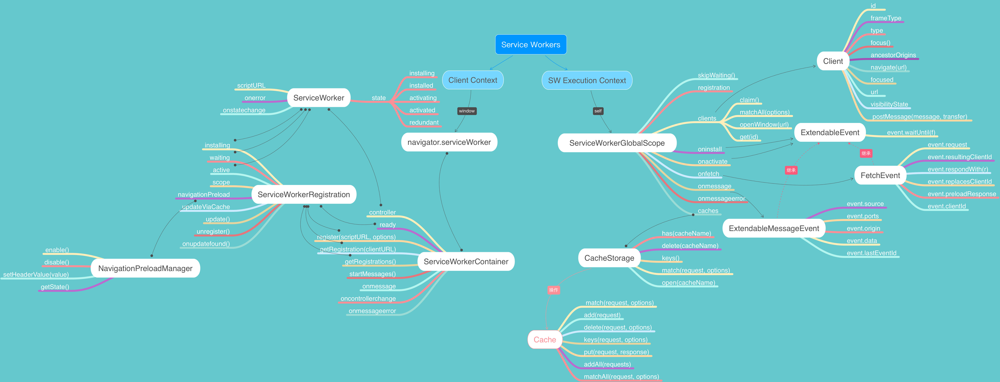

一直以来，web app 想要做到与 native app 一样的用户体验。其中一个最重要的技术难道题是离线支持（离线状态下，也能访问页面）。虽然之前浏览器提供 [AppCache](https://developer.mozilla.org/en-US/docs/Web/HTML/Using_the_application_cache) 来支持离线访问。但 AppCache 在开发过程中暴露一些缺陷：

- 内容更新需要刷新两次才会生效
- manifest 文件的任何改变都会引起 manifest 中列举的所有文件都重新下载
- 一旦 manifest 文件下载完，浏览器就会同步下载 manifest 文件中列举的资源。这可能会阻塞页面的渲染。
- 不可靠的 API。如 `window.applicationCache.onupdateready` 有时在 iPhone 和 Android 设备上不会被触发。
- 更多参考：[Problems with Application Cache](http://blog.jamesdbloom.com/ProblemsWithApplicationCache.html)
- 其他相关文章：[Application Cache is a Douchebag](https://alistapart.com/article/application-cache-is-a-douchebag)

如何避免 AppCache 常见的问题

- [Tips for using Application Cache](http://blog.jamesdbloom.com/TipsForUsingApplicationCache.html)
- [Common Pitfalls to Avoid when using HTML5 Application Cache](https://www.sitepoint.com/common-pitfalls-avoid-using-html5-application-cache/)

让开发欣慰的事 AppCache 使用上相对容易，不过需要遵循诸多规则。如果不严格遵循这些规则，可能会适得其反，会让 app 体验变得更糟糕。AppCache 的诸多不足，最终让它从 Web 规范中被移除，并被 Service worker 代替。虽然 Service worker 使用上比 AppCache 更复杂。但这样可让开发人员更加精细地控制缓存行为，能很好地避免 AppCache 的问题。

## 什么是 Service Worker(SW)?

> The easiest way to think about service workers is as a piece of code that is installed by a site on a client machine, runs in the background, and subsequently enables requests sent to that site to be intercepted and manipulated. —— Simon Jones

Service Worker 是一个安装在客户端，运行在后台，能拦截和操作 web app 请求的脚本。

> singsong: 为了方便理解，可以将 Service Worker 看成一个介于客户端与服务端的代理服务。如 Fiddler、Charles。

## Service Worker 能做什么

Service Worker(SW）是一种新兴的浏览器技术，它除了能让 web app 拥有离线体验外，还有
[消息推送](https://developers.google.com/web/fundamentals/codelabs/push-notifications/)、[后台更新](https://github.com/WICG/BackgroundSync/blob/master/explainer.md)、[定期更新](https://developer.mozilla.org/en-US/docs/Web/API/ServiceWorkerRegistration/periodicSync)、[地理围栏](https://developers.google.com/location-context/geofencing/)等功能。这让 web app 可在浏览器中提供类似 native app 一样的用户体验。它也是
[progressive web apps（PWA）](https://inviqa.com/blog/how-get-started-progressive-web-apps)一个核心组成部分。
Service Worker 功能很强大👍，再介绍如何使用 Service Worker 之前，需要了解一下 Service Worker 的特性及生命周期。这样才能更好地使用它。

## Service Worker 特性
Service Worker 本身也是 [worker](https://developer.mozilla.org/en-US/docs/Web/API/Web_Workers_API/Using_web_workers)，即它也有 worker 的特性：

* 运行在自己的上下文中(线程)
* 不能访问 DOM

除了拥有 worker 的特性外，它还有自己的特有特性：

* 事件驱动
* 异步
* 安全(HTTPS)
* 更新模型
* 顶级导航匹配

### 事件驱动

如果将 Service Worker 设计成 与 [shared worker](https://html.spec.whatwg.org/multipage/workers.html#sharedworker) 一样。即它生命周期与它所控制的页面关联。这样只有当它所控制的所有页面或窗口都关闭了，Service Worker 才会被回收。如果页面没有关闭，Service Worker 会一直运行。而且随着启动 Service Worker 数量增多，消耗资源和电源更多，这对移动端影响更大。

因此，考虑性能问题，Service Worker 采用了事件驱动模式。当某个事件（**install**, **activate**, **message**, **fetch**, **push**等）触发时会启动 Service Worker，事件执行完后就终止掉。

如果没有事件让 Service Worker 保持工作，浏览器就可以随时关闭 Service Worker，并回收 Service Worker 所使用的资源。当再有事件被触发，Service Worker 会被重新激活。

> Service workers intentionally have very short lifespans. They are "born" in response to a specific event (install, activate, message, fetch, push, etc.), perform their task, and then "die" shortly thereafter. The lifespan is normally long enough that multiple events might be handled (i.e. an install might be followed by an activate followed by a fetch) before the worker dies, but it will die eventually. This is why it's very important not to rely on any global state in your scripts, and to bootstrap any state information you need via IndexedDB or the Cache Storage API when your Service Worker starts up. [more info ……](https://stackoverflow.com/questions/29741922/prevent-service-worker-from-automatically-stopping)

另外，由于 Service Worker 会频繁地重启，所以不能依赖全局变量(global state)在事件处理函数之间共享状态。因为每次 Service Worker 重启都会重新初始化全局状态。如果需要共享状态，可以使用 [IndexedDB API](https://developer.mozilla.org/en-US/docs/Web/API/IndexedDB_API) 或 [Cache API](https://developer.mozilla.org/en-US/docs/Web/API/Cache) 将数据本地持久化。[更多详情……](https://stackoverflow.com/questions/38835273/when-does-code-in-a-service-worker-outside-of-an-event-handler-run/38835274#38835274)

> singsong：当 Service Worker 处于 Idle（空闲）时，浏览器会某个时间段内终止掉sw。这个时间段对每个浏览器都不一样。有1m或30s。[Chrome 使用30s](https://groups.google.com/a/chromium.org/forum/#!topic/chromium-reviews/xVXklMLtekY)。[更多详情……](https://love2dev.com/blog/service-worker-termination/)

### 异步

Service Worker 几乎所有工作都依赖于 DOM 事件作为入口。除 `importScripts()` 外，Service Worker 支持 APIs 都是异步的（即不能使用同步 [Local Storage](https://flaviocopes.com/web-storage-api/) 和 [XHR](https://flaviocopes.com/xhr/) APIs）。如下是一些常用 APIs：

  - [Channel Messaging API](https://flaviocopes.com/channel-messaging-api/)
  - [Fetch API](https://flaviocopes.com/fetch-api/)
  - [Cache API](https://flaviocopes.com/cache-api/)
  - [Promises](https://flaviocopes.com/javascript-promises/)


而 Service Worker 又是事件驱动的，当事件处理函数执行完事件就随之结束。此时，可能事件处理函数中的异步操作还没执行完。为了确保异步操作的完整性，这里可以调用 [`e.waitUntil()`](#event.waitUntil(f)) 和 [`e.respondWith()`](#event.respondWith(r)) 延长事件的生命周期。

另外，长时间运行或 CPU 密集型工作可能导致 Service Worker 无法响应。这种情况下，可以将计算工作委托给其他 worker。且这些 worker 会随着 Service Worker 终止而终止。


### 安全

Service Worker 的功能很强大，因此需要有对应的安全限制来防止它被滥用。
- [只能在安全环境下工作——**HTTPS**（开发环境，可以使用**localhost**、127.0.0.0/8、::1/128）](https://w3c.github.io/ServiceWorker/#secure-context)。
- 遵循[同源策略](https://developer.mozilla.org/zh-CN/docs/Web/Security/Same-origin_policy)。
- `scope`(作用范围)。
  一般我们会将 Service Worker 的作用范围设置为项目的 root 目录(`/sw.js`)。这样 Service Worker 可以控制站点`/`的所有请求。如果将其设置为`/js/sw.js`，那 Service Worker 就只能控制`/js`下的请求。而`/`下的请求是不被受影响的。为什么要这样设置？

  > singsong: Service Worker 脚本文件的地址是相对于 origin，而不是 app 的根目录。
  
  假如有个商城平台：www.mall.com，并且允许第三方商家站点入驻。现在有两个商家(假如：huawei、mi)入驻：www.mall.com/huawei，www.mall.com/mi。假如商家 huawei 上传 Service Worker 到它站点（www.mall.com/huawei/sw.js）。浏览器如果没有对 Service Worker 作用范围做限制，`/huawei/sw.js` 就可以控制商家 mi 的流量导向，甚至 www.mall.com 的流量导向。为了避免类似情况发生，浏览器会对 Service Worker 作用范围做限制。Service Worker 只对所在目录和子目录有影响。这里我们可以通过浏览器提供的`scope`选项指定：

  ```js
  // 作用范围一样。即如果不指定scope，默认为sw.js所在目录
  navigator.serviceWorker.register('/sw.js');
  navigator.serviceWorker.register('/sw.js', { scope: '/' });
  ```

  如果要对不同的商家设定不同的 scope，可以这样设置：

  ```js
  navigator.serviceWorker.register('/sw-huawei.js', { scope: '/huawei' });
  navigator.serviceWorker.register('/sw-mi.js', { scope: '/mi' });
  ```

### [更新模型](https://github.com/w3c/ServiceWorker/blob/master/explainer.md#updating-a-service-worker)

Service Worker 的更新模型与 Chrome 类似：在不打扰用户前提下，在后台进行更新操作。在旧版本 Service Worker 卸载后完成更新。

无论何时只要进入安装了 Service Worker 的页面。浏览器都会在后台检查 Service Worker 脚本是否更新。[即使是一字节的变化，浏览器都会将 Service Worker 脚本视为新的 Service Worker 脚本](https://w3c.github.io/ServiceWorker/#update-algorithm)。接着会将其安装、激活、取代旧版本 Service Worker 控制当前页面。不过如果被旧版本 Service Worker 控制的页面仍在运行，此时新版本 Service Worker 会处于 waiting 状态。只有当旧版本 Service Worker 控制的所有页面都关闭了（如关闭在旧 Service Worker 作用范围内的 window 或 tab，或跳转到不在旧 Service Worker 作用范围内的页面）。旧版本 Service Worker 才会被回收，新版本 Service Worker 激活并接管控制页面。

> singsong: 浏览器只对 Service Worker 脚本做检查，不会检查脚本中`importScripts`引用外部脚本。另外，还需要注意的是，浏览器缓存机制对 Service Worker 脚本的影响。如`max-age`。如果服务器对 Service Worker 脚本设置`max-age`大于 24 小时，在这种情况浏览器会将`max-age`设置为 24 小时。即 Service Worker 脚本缓存有效期最大为一天时长。[更多详情……](https://stackoverflow.com/questions/38843970/service-worker-javascript-update-frequency-every-24-hours/38854905#38854905)

### 顶级导航匹配

为了优化性能，浏览器会维护一个 `scope` 到 [Service Worker Registration](https://w3c.github.io/ServiceWorker/#service-worker-registration-concept) 映射关系。称为 **Registration map**。 这样能快速地查找对应的 Service Worker。当请求(fetch)一个顶级文档导航时，为了确定由哪个 Server worker 来处理。浏览器会获取当前 `origin + URL` 执行匹配。一旦匹配成功会执行对应的 Service Worker 脚本实例化 Service Worker（如果当前没有运行的 Service Worker 实例）控制当前页面。[具体匹配算法……](https://w3c.github.io/ServiceWorker/#scope-match-algorithm)


另外，为了进一步优化，匹配算法只对顶级文档导航工作，随后的子资源的请求都会被发送到控制当页面的 Service Worker。这里的顶级文档导航即页面请求或页面第一个请求。如[https://www.zhansingsong.com/](https://www.zhansingsong.com/) 页面：
> 

## Service Worker 生命周期

当一个页面注册一个新的 Service Worker 时，会经过如下状态：


- Installing

  当用 `navigator.serviceWorker.register` 新注册一个 Service Worker 时。浏览器会下载这个 Service Worker 文件，并解析，然后进入 **Installing** 状态。如果安装成功，则会进入 **Installed** 状态。否则脚本会被丢弃，然后进入 **Redundant** 状态。
  另外，可以使用`event.waitUntil()`来扩展 `install` 事件。该方法接受一个 promise，只有当这个 promise 被 fulfilled 或 rejected 后。Service Worker 才能确定安装已完成。如果 promise 被 rejected，则 Service Worker 进入 **Redundant** 状态。

- Installed/Waiting

  一旦 Service Worker 安装成功，进入到 **Installed** 状态后。接着会立即进入到 activating 状态。但如果当前页面已被存在活动的 Service Worker 控制，这种情况下 新的 Service Worker 会等待去控制当前页面。所以这个状态也称为 **waiting** 状态。

- Activating

  在 Service Worker 被激活，且控制当前页面之前。`activate` 事件会被触发。该事件与 `install` 事件类似，可以使用`event.waitUntil()` 方法扩展 `activate`事件的生命周期。

- Activated

  当 Service Worker 被成功激活，并且控制当前页面。就可以监听页面的 `fetch` 事件，拦截页面中的请求。

  ~~> singsong: 一个 Service Worker 是在页面加载之前控制它们的。即在 Service Worker 进入 active 状态之前那些已加载完的页面，Service Worker 是不能控制它们的。~~

- Redundant

  Service Worker 只要在注册、安装期间失败，或被别的 Service Worker 取代。都会进入 **Redundant** 状态。这种状态下的 Service Worker 不会对你的程序产生任何影响。另外，在事件处理函数中非法操作（如无限循环和处理事件时存在超时的处理任务）也会导致 Service Worker 进入 **Redundant** 状态。

> The browser can terminate a running SW thread at almost any time. Chrome terminates a SW if the SW has been idle for 30 seconds. Chrome also detects long-running workers and terminates them. It does this if an event takes more than 5 minutes to settle, or if the worker is busy running synchronous JavaScript and does not respond to a ping within 30 seconds. When a SW is not running, Developer Tools and chrome://serviceworker-internals show its status as STOPPED. [more info ……](https://dev.chromium.org/Home/chromium-security/security-faq/service-worker-security-faq)

如果 Service Worker 在激活后，没有接收到任何 functional events，就会进入 idle 状态。闲置一段时间（如30s）后，Service Worker 就进入 terminated 状态。这并不意味着 Service Worker 已被卸载，因为此时还可以接收 functional events。只有当 Service Worker 完全被卸载后，就会进入 **Redundant** 状态。


> singsong：一个 Service Worker 和它状态是独立于任何一个浏览器窗口或 tab 项。即只要一个 Service Worker 成功被激活。它会直接保持此状态。即使有相同页面在新窗口打开，浏览器会尝试再次安装 Service Worker。如果浏览器检测到已经注册了这个 Service Worker，它就不会再次被安装。

### Service Worker 所支持的事件

Service Worker 之所以能拦截请求，主要是因为它能拦截 Service Worker 上下文中的事件。事件包括：lifecycle events，functional events，message events。[更多事件……](https://w3c.github.io/ServiceWorker/#execution-context-events)

| lifecycle events | functional events | message events |
| :--------------: | :---------------: | :------------: |
| install          | fetch             | message        |
| activate         | sync              |                |
|                  | push              |                |
|                  | notificationclick |                |

lifecycle events，functional events 和 message events 的共同点都继承了 [ExtendableEvent](https://w3c.github.io/ServiceWorker/#extendableevent)。ExtendableEvent 能延长事件的生命周期。每个 ExtendableEvent 都有一个关联的 [extend lifetime promises](https://w3c.github.io/ServiceWorker/#extendableevent-extend-lifetime-promises) 数组，只有当 extend lifetime promises 中待处理的 promises 都被处理，才会结束事件。具体操作由 ExtendableEvent 提供的 `event.waitUntil(f)` 方法来完成。


#### event.waitUntil(f)

[event.waitUntil(f)](https://w3c.github.io/ServiceWorker/#wait-until-method) 方法接受一个 promise 参数 f。直到 f 被 fulfilled 或 rejected，事件才会结束。该方法一般用于 `install`、`activate` 事件中，用于确保异步操作完整性。另外，不能在 ExtendableEvent 处理函数外部调用 `waitUntil()` 方法。否则会报 `InvalidStateError` 错误。

> Service workers delay treating the installing worker as installed until all the promises in the install event’s extend lifetime promises resolve successfully. If any of the promises rejects, the installation fails. This is primarily used to ensure that a Service Worker is not considered installed until all of the core caches it depends on are populated. Likewise, service workers delay treating the active worker as activated until all the promises in the activate event’s extend lifetime promises settle. (See the relevant Activate algorithm step.) This is primarily used to ensure that any functional events are not dispatched to the Service Worker until it upgrades database schemas and deletes the outdated cache entries. [more info ……](https://w3c.github.io/ServiceWorker/#dom-extendableevent-waituntil)

#### event.respondWith(r)

[event.respondWith(r)](https://w3c.github.io/ServiceWorker/#fetch-event-respondwith) 是 [FetchEvent](https://w3c.github.io/ServiceWorker/#wait-until-method) 的方法，用于 `fecth` 事件中，定制响应。与 `event.waitUntil(r)` 一样，也能扩展事件生命周期。不同的是参数 r 是一个 [Response](https://developer.mozilla.org/en-US/docs/Web/API/Response) 的 promise。

> [event.respondWith(r)](https://w3c.github.io/ServiceWorker/#dom-fetchevent-respondwith) extends the lifetime of the event by default as if [event.waitUntil(r)](https://w3c.github.io/ServiceWorker/#dom-extendableevent-waituntil) is called.

#### 粒子 🌰

```js
self.addEventListener('push', function() {
  fetch('/updates').then(function(response) {
    return self.registration.showNotification(response);
  });
});
```

这里为了方便讲解，使用了 `push` 事件([Push API](https://developer.mozilla.org/en-US/docs/Web/API/Push_API))，关于 `push` 读者只需知道当服务器 push 一个消息给客户端时，就会触发这个事件。当`push`事件被触发，此时在事件处理函数中会尝试从服务器请求`'/updates'`数据，并向客户端推送最新的数据。
不过这代码是有问题的。因为这里的 fetch 请求是异步的。当 `push` 事件的回调函数执行完，如果 Service Worker 上下文中没有其他事件被触发，浏览器就会随时终止 Service Worker。但可能此时 `'/update'` 的请求响应还没返回，从而导致异常错误产生。
如何让浏览器在 fetch 请求完成后再终止 Service Worker？这里就可以使用 `waitUntil()` 方法来扩展 `push` 事件的生命周期。

```js
self.addEventListener('push', function(event) {
  event.waitUntil(
    fetch('/updates').then(function() {
      return self.registration.showNotification(response);
    })
  );
});
```

`event.waitUntil()` 方法会让 `push` 事件等待 `fetch` 请求和 `showNotification` 调用完成后才会终止 Service Worker。
除了 `event.waitUntil()` 方法可扩展 Service Worker 事件生命周期外， `event.respondWith()` 也可以，不过它是 [FetchEvent](https://developer.mozilla.org/zh-CN/docs/Web/API/FetchEvent) 特有的方法。

```js
self.addEventListener('fetch', function(event) {
  if (event.request.url === '/') {
    event.respondWith(fetch('/update').then(response => response));
  } else {
    // do something...
  }
});
```

本文到此，已对 Service Worker 有了初步的认识。那究竟如何使用它，让 web app 拥有更好的用户体验？

## 如何使用 Service Worker

前文在对 Service Worker 做介绍时了解到 Service Worker 是个 JavaScript 文件。这里假设这个文件为：`sw.js`，且位于项目根目录下。至于 `sw.js` 内容本文后面会讲解到。要使用 Service Worker 第一步骤，就是注册 `sw.js` 文件。首先得检测浏览器是否支持 Service Worker。如果支持，在文档加载完就注册 `sw.js` 文件。

### 注册

```js
/* main.js */
if ('serviceWorker' in navigator) {
  window.addEventListener('load', () => {
    navigator.serviceWorker.register('/sw.js').then(
      function(registration) {
        // Registration was successful
        console.log(
          'ServiceWorker registration successful with scope: ',
          registration.scope
        );
      },
      function(err) {
        // registration failed :(
        console.log('ServiceWorker registration failed: ', err);
      }
    );
  });
} else {
  console.log('Service Workers not supported');
}
```

> singsong：假设这里注册代码是在 main.js 文件中

当浏览器开始注册 `sw.js` 时，会先从 `/sw.js` 路径下下载 `sw.js`，然后解析。如果解析成功就可以访问 Service Worker 的注册对象 registration。这个对象包含了一些 Service Worker 信息，如当前状态、scope 等。如果注册失败 `sw.js` 文件会被丢弃。一旦解析成功，Service Worker 就会进入下个状态：**Installing**

### 安装

浏览器在尝试安装 Service Worker 时，可以通过 `registration.installing` 获取 Service Worker 是否处在安装状态：

```js
/* main.js */
navigator.serviceWorker.register('./sw.js').then((registration) => {
  if (registration.installing) {
    // Service Worker is Installing
  }
});
```

在安装期间，浏览器会触发 Service Worker 的 `install` 事件。一般可以在这个事件对一些静态资源进行预缓存处理：

```js
/* sw.js */
const VERSION = 'V1';
const currentCacheName = `filesToCache-${VERSION}`;
const assetsToCache = ['demo.jpg', 'demo.css', 'demo.js'];
self.addEventListener('install', (event) => {
  event.waitUntil(
    // 扩展install的执行周期，直到cache返回的promise被fulfilled或rejected。
    caches.open(currentCacheName).then((cache) => {
      // 打开currentCacheName缓存
      return cache.addAll(assetsToCache); // 将资源存到cache中
    })
  );
});
```

这里使用 `event.waitUntil()` 方法来确保缓存操作已完成。它能扩展 Service Worker 的 `install` 事件的执行周期，直到 cache 返回的 promise 被 fulfilled 或 rejected（如果为 rejected，service worker 会进入 **redundant** 状态）。因为`cache.addAll()` 方法是异步的。可能存在当 install 事件执行完，`cache.addAll()` 还没有完成缓存操作。当 Service Worker 安装成功后就会进入 **installed** 状态，如果当前存在其他 Service Worker 控制 Clients，它需要等待去控制 Clients。所以这个状态也称为 **waiting** 状态。


当然这里可以调用 [ServiceWorkerGlobalScope.skipWaiting()](https://developer.mozilla.org/en-US/docs/Web/API/ServiceWorkerGlobalScope/skipWaiting) 方法，跳过等待过程，直接进入 **activating** 状态。

```js
/* main.js */
navigator.serviceWorker.register('./sw.js').then((registration) => {
  if (registration.waiting) {
    self.skipWaiting();
  }
});
```
如下场景都会让一个 waiting 状态的 Service Worker 进入 activating 状态：

- 没有活动 Service Worker。
- 调用 [ServiceWorkerGlobalScope.skipWaiting()](https://developer.mozilla.org/en-US/docs/Web/API/ServiceWorkerGlobalScope/skipWaiting) 方法。
- 控制 Clients 的 Service Workers 被回收。如离开页面、Service Worker 文件过期等。

### 激活

Service Worker 在激活期间，会触发 `activate` 事件，一般可以在该事件处理函数中对旧缓存进行删除处理。

```js
const VERSION = "V1";
const currentCacheName = `filesToCache-${VERSION}`;
/* sw.js */
self.addEventListener('activate', (event) => {
  event.waitUntil(
    // Get all the cache names
    caches.keys().then((cacheNames) => {
      return Promise.all(
        // Get all the items that are stored under a different cache name than the current one
        cacheNames
          .filter((cacheName) => {
            return cacheName != currentCacheName;
          })
          .map((cacheName) => {
            // Delete the items
            return caches.delete(cacheName);
          })
      ); // end Promise.all()
    }) // end caches.keys()
  ); // end event.waitUntil()
});
```

类似于 install 事件，这里也使用 `event.waitUntil()` 方法扩展 `activate` 事件的执行周期。同样只要`event.waitUntil()` 接受的 promise 被 rejected，Service Worker 就会变为 **redundant** 状态。

### 网络拦截

当 Service Worker 激活后，Service Worker 就完全控制 app。此时就可以使用 `fetch` 事件拦截请求。

```js
self.addEventListener('fetch', (event) => {
  console.log(event.request);
});
```
`event.request` 对象包含了请求相关的信息：URL、method 和请求头的信息。另外，需要注意的是：Service Worker 的 `fetch` 事件可以拦截当前页面内任何请求，即使它们是来自另一个来源。如 CSS、JS、images、XHR 等。但除了如下情况例外：

- iframe 和 `<object>` —— 这些会根据其的 URL 选择自己的 Service Worker。
- Service Worker —— 获取或更新一个 Service Worker 的请求不会经过当前 Service worker。
- 在一个 Service Worker 中触发的请求。

除了可以劫持请求外，还可以定制响应：

```js
self.addEventListener('fetch', (event) => {
  event.respondWith(new Response('Hello world!'));
});
```

在Service Worker 激活后，还可以使用 `message` 事件与 window 或其他 worker 进行通信。

```js
self.addEventListener('message', (event) => {
  // Do stuff with postMessages received from document
});
```

实战操作可以参考 Google 的官方实例：[Adding a Service Worker and Offline into your Web App](https://codelabs.developers.google.com/codelabs/offline/index.html?index=..%2F..index#0)


## Service Worker Cache

Service Worker 规范定义了两个缓存相关的 API：

- [CacheStorage]([CacheStorage](https://developer.mozilla.org/en-US/docs/Web/API/CacheStorage))
- [Cache](https://developer.mozilla.org/en-US/docs/Web/API/Cache)

在 Service Worker 中做持久化时，常会使用这个两个接口。为了方便理解，这里以 [mongoDB](https://www.mongodb.com/) 做个类比：

- CacheStorage 类似 mongodb 服务。管理所有的 Cache，是整个缓存入口。在  Service Worker 上下文中通过 `caches` 获取。

- Cache 类似 mongodb 中 database。

Service Worker Cache 并没有取代了 Browser/HTTP cache。

- Browser/HTTP Cache
  
  浏览器默认的缓存方式。一般只能由 HTTP header 控制。没有任何 JavaScript API 可以直接控制它。不过可以通过一些技巧越过它。如在请求参数中增加个版本号或时间戳等
- Service Worker Cache
  
  这是一种用于 Service Worker 新兴缓存。它不仅仅是一个新的缓存 API，且完全独立于浏览器标准缓存。它存储在一个单独的地方，并以不同的方式管理。即 HTTP header 是不能影响它的。

### 缓存顺序

Service Worker Cache 是不能影响 Browser/HTTP Cache。要使用好 Service Worker Cache，需要理解浏览器对 Service Worker Cache 和 Browser/HTTP Cache 处理顺序：


当用户发起一个请求时，浏览器处理顺序如下：

1. 尝试从 Service Worker Cache 获取请求资源。如果 Service Worker Cache 存在请求资源，直接响应。此时就不往下走了。
2. 尝试从 Browser Cache 获取请求资源。当 Service Worker Cache 没存在请求资源，会走到 Browser Cache，并检查 Browser Cache 是否存在请求资源。如果存在，直接响应。
3. 从 server 获取请求资源。如果当请求资源都没有缓存在 Service Worker Cache 和 Browser Cache，浏览器会 fetch 请求给 server。

从缓存顺利处理图也可以知道：

- 当注册了 Service Worker 后，Service Worker 就能控制任何请求
- Service Worker 是不能直接控制浏览器是否从服务器上获取请求数据
- [更多详情……](https://enux.pl/article/en/2018-05-05/pwa-and-http-caching)


## 参考文章

- [The Service Worker Lifecycle](https://bitsofco.de/the-service-worker-lifecycle/)
- [Service Worker Security FAQ](https://dev.chromium.org/Home/chromium-security/security-faq/service-worker-security-faq)
- [Service Workers Nightly](https://w3c.github.io/ServiceWorker/#motivations)
- [The offline cookbook](https://jakearchibald.com/2014/offline-cookbook/)
- [How to Fix the Refresh Button When Using Service Workers](https://redfin.engineering/how-to-fix-the-refresh-button-when-using-service-workers-a8e27af6df68)
- [How to display a "new version available" for a Progressive Web App](https://deanhume.com/displaying-a-new-version-available-progressive-web-app/)](

一直以来，web app 想要做到与 native app 一样的用户体验。其中一个最重要的技术难道题是离线支持（离线状态下，也能访问页面）。虽然之前浏览器提供 [AppCache](https://developer.mozilla.org/en-US/docs/Web/HTML/Using_the_application_cache) 来支持离线访问。但 AppCache 在开发过程中暴露一些缺陷：

- 内容更新需要刷新两次才会生效
- manifest 文件的任何改变都会引起 manifest 中列举的所有文件都重新下载
- 一旦 manifest 文件下载完，浏览器就会同步下载 manifest 文件中列举的资源。这可能会阻塞页面的渲染。
- 不可靠的 API。如 `window.applicationCache.onupdateready` 有时在 iPhone 和 Android 设备上不会被触发。
- 更多参考：[Problems with Application Cache](http://blog.jamesdbloom.com/ProblemsWithApplicationCache.html)
- 其他相关文章：[Application Cache is a Douchebag](https://alistapart.com/article/application-cache-is-a-douchebag)

如何避免 AppCache 常见的问题

- [Tips for using Application Cache](http://blog.jamesdbloom.com/TipsForUsingApplicationCache.html)
- [Common Pitfalls to Avoid when using HTML5 Application Cache](https://www.sitepoint.com/common-pitfalls-avoid-using-html5-application-cache/)

让开发欣慰的事 AppCache 使用上相对容易，不过需要遵循诸多规则。如果不严格遵循这些规则，可能会适得其反，会让 app 体验变得更糟糕。AppCache 的诸多不足，最终让它从 Web 规范中被移除，并被 Service worker 代替。虽然 Service worker 使用上比 AppCache 更复杂。但这样可让开发人员更加精细地控制缓存行为，能很好地避免 AppCache 的问题。

## 什么是 Service Worker(SW)?

> The easiest way to think about service workers is as a piece of code that is installed by a site on a client machine, runs in the background, and subsequently enables requests sent to that site to be intercepted and manipulated. —— Simon Jones

Service Worker 是一个安装在客户端，运行在后台，能拦截和操作 web app 请求的脚本。

> singsong: 为了方便理解，可以将 Service Worker 看成一个介于客户端与服务端的代理服务。如 Fiddler、Charles。

## Service Worker 能做什么

Service Worker(SW）是一种新兴的浏览器技术，它除了能让 web app 拥有离线体验外，还有
[消息推送](https://developers.google.com/web/fundamentals/codelabs/push-notifications/)、[后台更新](https://github.com/WICG/BackgroundSync/blob/master/explainer.md)、[定期更新](https://developer.mozilla.org/en-US/docs/Web/API/ServiceWorkerRegistration/periodicSync)、[地理围栏](https://developers.google.com/location-context/geofencing/)等功能。这让 web app 可在浏览器中提供类似 native app 一样的用户体验。它也是
[progressive web apps（PWA）](https://inviqa.com/blog/how-get-started-progressive-web-apps)一个核心组成部分。
Service Worker 功能很强大👍，再介绍如何使用 Service Worker 之前，需要了解一下 Service Worker 的特性及生命周期。这样才能更好地使用它。

## Service Worker 特性
Service Worker 本身也是 [worker](https://developer.mozilla.org/en-US/docs/Web/API/Web_Workers_API/Using_web_workers)，即它也有 worker 的特性：

* 运行在自己的上下文中(线程)
* 不能访问 DOM

除了拥有 worker 的特性外，它还有自己的特有特性：

* 事件驱动
* 异步
* 安全(HTTPS)
* 更新模型
* 顶级导航匹配

### 事件驱动

如果将 Service Worker 设计成 与 [shared worker](https://html.spec.whatwg.org/multipage/workers.html#sharedworker) 一样。即它生命周期与它所控制的页面关联。这样只有当它所控制的所有页面或窗口都关闭了，Service Worker 才会被回收。如果页面没有关闭，Service Worker 会一直运行。而且随着启动 Service Worker 数量增多，消耗资源和电源更多，这对移动端影响更大。

因此，考虑性能问题，Service Worker 采用了事件驱动模式。当某个事件（**install**, **activate**, **message**, **fetch**, **push**等）触发时会启动 Service Worker，事件执行完后就终止掉。

如果没有事件让 Service Worker 保持工作，浏览器就可以随时关闭 Service Worker，并回收 Service Worker 所使用的资源。当再有事件被触发，Service Worker 会被重新激活。

> Service workers intentionally have very short lifespans. They are "born" in response to a specific event (install, activate, message, fetch, push, etc.), perform their task, and then "die" shortly thereafter. The lifespan is normally long enough that multiple events might be handled (i.e. an install might be followed by an activate followed by a fetch) before the worker dies, but it will die eventually. This is why it's very important not to rely on any global state in your scripts, and to bootstrap any state information you need via IndexedDB or the Cache Storage API when your Service Worker starts up. [more info ……](https://stackoverflow.com/questions/29741922/prevent-service-worker-from-automatically-stopping)

另外，由于 Service Worker 会频繁地重启，所以不能依赖全局变量(global state)在事件处理函数之间共享状态。因为每次 Service Worker 重启都会重新初始化全局状态。如果需要共享状态，可以使用 [IndexedDB API](https://developer.mozilla.org/en-US/docs/Web/API/IndexedDB_API) 或 [Cache API](https://developer.mozilla.org/en-US/docs/Web/API/Cache) 将数据本地持久化。[更多详情……](https://stackoverflow.com/questions/38835273/when-does-code-in-a-service-worker-outside-of-an-event-handler-run/38835274#38835274)

> singsong：当 Service Worker 处于 Idle（空闲）时，浏览器会某个时间段内终止掉sw。这个时间段对每个浏览器都不一样。有1m或30s。[Chrome 使用30s](https://groups.google.com/a/chromium.org/forum/#!topic/chromium-reviews/xVXklMLtekY)。[更多详情……](https://love2dev.com/blog/service-worker-termination/)

### 异步

Service Worker 几乎所有工作都依赖于 DOM 事件作为入口。除 `importScripts()` 外，Service Worker 支持 APIs 都是异步的（即不能使用同步 [Local Storage](https://flaviocopes.com/web-storage-api/) 和 [XHR](https://flaviocopes.com/xhr/) APIs）。如下是一些常用 APIs：

  - [Channel Messaging API](https://flaviocopes.com/channel-messaging-api/)
  - [Fetch API](https://flaviocopes.com/fetch-api/)
  - [Cache API](https://flaviocopes.com/cache-api/)
  - [Promises](https://flaviocopes.com/javascript-promises/)


而 Service Worker 又是事件驱动的，当事件处理函数执行完事件就随之结束。此时，可能事件处理函数中的异步操作还没执行完。为了确保异步操作的完整性，这里可以调用 [`e.waitUntil()`](#event.waitUntil(f)) 和 [`e.respondWith()`](#event.respondWith(r)) 延长事件的生命周期。

另外，长时间运行或 CPU 密集型工作可能导致 Service Worker 无法响应。这种情况下，可以将计算工作委托给其他 worker。且这些 worker 会随着 Service Worker 终止而终止。


### 安全

Service Worker 的功能很强大，因此需要有对应的安全限制来防止它被滥用。
- [只能在安全环境下工作——**HTTPS**（开发环境，可以使用**localhost**、127.0.0.0/8、::1/128）](https://w3c.github.io/ServiceWorker/#secure-context)。
- 遵循[同源策略](https://developer.mozilla.org/zh-CN/docs/Web/Security/Same-origin_policy)。
- `scope`(作用范围)。
  一般我们会将 Service Worker 的作用范围设置为项目的 root 目录(`/sw.js`)。这样 Service Worker 可以控制站点`/`的所有请求。如果将其设置为`/js/sw.js`，那 Service Worker 就只能控制`/js`下的请求。而`/`下的请求是不被受影响的。为什么要这样设置？

  > singsong: Service Worker 脚本文件的地址是相对于 origin，而不是 app 的根目录。
  
  假如有个商城平台：www.mall.com，并且允许第三方商家站点入驻。现在有两个商家(假如：huawei、mi)入驻：www.mall.com/huawei，www.mall.com/mi。假如商家 huawei 上传 Service Worker 到它站点（www.mall.com/huawei/sw.js）。浏览器如果没有对 Service Worker 作用范围做限制，`/huawei/sw.js` 就可以控制商家 mi 的流量导向，甚至 www.mall.com 的流量导向。为了避免类似情况发生，浏览器会对 Service Worker 作用范围做限制。Service Worker 只对所在目录和子目录有影响。这里我们可以通过浏览器提供的`scope`选项指定：

  ```js
  // 作用范围一样。即如果不指定scope，默认为sw.js所在目录
  navigator.serviceWorker.register('/sw.js');
  navigator.serviceWorker.register('/sw.js', { scope: '/' });
  ```

  如果要对不同的商家设定不同的 scope，可以这样设置：

  ```js
  navigator.serviceWorker.register('/sw-huawei.js', { scope: '/huawei' });
  navigator.serviceWorker.register('/sw-mi.js', { scope: '/mi' });
  ```

### [更新模型](https://github.com/w3c/ServiceWorker/blob/master/explainer.md#updating-a-service-worker)

Service Worker 的更新模型与 Chrome 类似：在不打扰用户前提下，在后台进行更新操作。在旧版本 Service Worker 卸载后完成更新。

无论何时只要进入安装了 Service Worker 的页面。浏览器都会在后台检查 Service Worker 脚本是否更新。[即使是一字节的变化，浏览器都会将 Service Worker 脚本视为新的 Service Worker 脚本](https://w3c.github.io/ServiceWorker/#update-algorithm)。接着会将其安装、激活、取代旧版本 Service Worker 控制当前页面。不过如果被旧版本 Service Worker 控制的页面仍在运行，此时新版本 Service Worker 会处于 waiting 状态。只有当旧版本 Service Worker 控制的所有页面都关闭了（如关闭在旧 Service Worker 作用范围内的 window 或 tab，或跳转到不在旧 Service Worker 作用范围内的页面）。旧版本 Service Worker 才会被回收，新版本 Service Worker 激活并接管控制页面。

> singsong: 浏览器只对 Service Worker 脚本做检查，不会检查脚本中`importScripts`引用外部脚本。另外，还需要注意的是，浏览器缓存机制对 Service Worker 脚本的影响。如`max-age`。如果服务器对 Service Worker 脚本设置`max-age`大于 24 小时，在这种情况浏览器会将`max-age`设置为 24 小时。即 Service Worker 脚本缓存有效期最大为一天时长。[更多详情……](https://stackoverflow.com/questions/38843970/service-worker-javascript-update-frequency-every-24-hours/38854905#38854905)

### 顶级导航匹配

为了优化性能，浏览器会维护一个 `scope` 到 [Service Worker Registration](https://w3c.github.io/ServiceWorker/#service-worker-registration-concept) 映射关系。称为 **Registration map**。 这样能快速地查找对应的 Service Worker。当请求(fetch)一个顶级文档导航时，为了确定由哪个 Server worker 来处理。浏览器会获取当前 `origin + URL` 执行匹配。一旦匹配成功会执行对应的 Service Worker 脚本实例化 Service Worker（如果当前没有运行的 Service Worker 实例）控制当前页面。[具体匹配算法……](https://w3c.github.io/ServiceWorker/#scope-match-algorithm)


另外，为了进一步优化，匹配算法只对顶级文档导航工作，随后的子资源的请求都会被发送到控制当页面的 Service Worker。这里的顶级文档导航即页面请求或页面第一个请求。如[https://www.zhansingsong.com/](https://www.zhansingsong.com/) 页面：
> 

## Service Worker 生命周期

当一个页面注册一个新的 Service Worker 时，会经过如下状态：


- Installing

  当用 `navigator.serviceWorker.register` 新注册一个 Service Worker 时。浏览器会下载这个 Service Worker 文件，并解析，然后进入 **Installing** 状态。如果安装成功，则会进入 **Installed** 状态。否则脚本会被丢弃，然后进入 **Redundant** 状态。
  另外，可以使用`event.waitUntil()`来扩展 `install` 事件。该方法接受一个 promise，只有当这个 promise 被 fulfilled 或 rejected 后。Service Worker 才能确定安装已完成。如果 promise 被 rejected，则 Service Worker 进入 **Redundant** 状态。

- Installed/Waiting

  一旦 Service Worker 安装成功，进入到 **Installed** 状态后。接着会立即进入到 activating 状态。但如果当前页面已被存在活动的 Service Worker 控制，这种情况下 新的 Service Worker 会等待去控制当前页面。所以这个状态也称为 **waiting** 状态。

- Activating

  在 Service Worker 被激活，且控制当前页面之前。`activate` 事件会被触发。该事件与 `install` 事件类似，可以使用`event.waitUntil()` 方法扩展 `activate`事件的生命周期。

- Activated

  当 Service Worker 被成功激活，并且控制当前页面。就可以监听页面的 `fetch` 事件，拦截页面中的请求。

  ~~> singsong: 一个 Service Worker 是在页面加载之前控制它们的。即在 Service Worker 进入 active 状态之前那些已加载完的页面，Service Worker 是不能控制它们的。~~

- Redundant

  Service Worker 只要在注册、安装期间失败，或被别的 Service Worker 取代。都会进入 **Redundant** 状态。这种状态下的 Service Worker 不会对你的程序产生任何影响。另外，在事件处理函数中非法操作（如无限循环和处理事件时存在超时的处理任务）也会导致 Service Worker 进入 **Redundant** 状态。

> The browser can terminate a running SW thread at almost any time. Chrome terminates a SW if the SW has been idle for 30 seconds. Chrome also detects long-running workers and terminates them. It does this if an event takes more than 5 minutes to settle, or if the worker is busy running synchronous JavaScript and does not respond to a ping within 30 seconds. When a SW is not running, Developer Tools and chrome://serviceworker-internals show its status as STOPPED. [more info ……](https://dev.chromium.org/Home/chromium-security/security-faq/service-worker-security-faq)

如果 Service Worker 在激活后，没有接收到任何 functional events，就会进入 idle 状态。闲置一段时间（如30s）后，Service Worker 就进入 terminated 状态。这并不意味着 Service Worker 已被卸载，因为此时还可以接收 functional events。只有当 Service Worker 完全被卸载后，就会进入 **Redundant** 状态。


> singsong：一个 Service Worker 和它状态是独立于任何一个浏览器窗口或 tab 项。即只要一个 Service Worker 成功被激活。它会直接保持此状态。即使有相同页面在新窗口打开，浏览器会尝试再次安装 Service Worker。如果浏览器检测到已经注册了这个 Service Worker，它就不会再次被安装。

### Service Worker 所支持的事件

Service Worker 之所以能拦截请求，主要是因为它能拦截 Service Worker 上下文中的事件。事件包括：lifecycle events，functional events，message events。[更多事件……](https://w3c.github.io/ServiceWorker/#execution-context-events)

| lifecycle events | functional events | message events |
| :--------------: | :---------------: | :------------: |
| install          | fetch             | message        |
| activate         | sync              |                |
|                  | push              |                |
|                  | notificationclick |                |

lifecycle events，functional events 和 message events 的共同点都继承了 [ExtendableEvent](https://w3c.github.io/ServiceWorker/#extendableevent)。ExtendableEvent 能延长事件的生命周期。每个 ExtendableEvent 都有一个关联的 [extend lifetime promises](https://w3c.github.io/ServiceWorker/#extendableevent-extend-lifetime-promises) 数组，只有当 extend lifetime promises 中待处理的 promises 都被处理，才会结束事件。具体操作由 ExtendableEvent 提供的 `event.waitUntil(f)` 方法来完成。


#### event.waitUntil(f)

[event.waitUntil(f)](https://w3c.github.io/ServiceWorker/#wait-until-method) 方法接受一个 promise 参数 f。直到 f 被 fulfilled 或 rejected，事件才会结束。该方法一般用于 `install`、`activate` 事件中，用于确保异步操作完整性。另外，不能在 ExtendableEvent 处理函数外部调用 `waitUntil()` 方法。否则会报 `InvalidStateError` 错误。

> Service workers delay treating the installing worker as installed until all the promises in the install event’s extend lifetime promises resolve successfully. If any of the promises rejects, the installation fails. This is primarily used to ensure that a Service Worker is not considered installed until all of the core caches it depends on are populated. Likewise, service workers delay treating the active worker as activated until all the promises in the activate event’s extend lifetime promises settle. (See the relevant Activate algorithm step.) This is primarily used to ensure that any functional events are not dispatched to the Service Worker until it upgrades database schemas and deletes the outdated cache entries. [more info ……](https://w3c.github.io/ServiceWorker/#dom-extendableevent-waituntil)

#### event.respondWith(r)

[event.respondWith(r)](https://w3c.github.io/ServiceWorker/#fetch-event-respondwith) 是 [FetchEvent](https://w3c.github.io/ServiceWorker/#wait-until-method) 的方法，用于 `fecth` 事件中，定制响应。与 `event.waitUntil(r)` 一样，也能扩展事件生命周期。不同的是参数 r 是一个 [Response](https://developer.mozilla.org/en-US/docs/Web/API/Response) 的 promise。

> [event.respondWith(r)](https://w3c.github.io/ServiceWorker/#dom-fetchevent-respondwith) extends the lifetime of the event by default as if [event.waitUntil(r)](https://w3c.github.io/ServiceWorker/#dom-extendableevent-waituntil) is called.

#### 粒子 🌰

```js
self.addEventListener('push', function() {
  fetch('/updates').then(function(response) {
    return self.registration.showNotification(response);
  });
});
```

这里为了方便讲解，使用了 `push` 事件([Push API](https://developer.mozilla.org/en-US/docs/Web/API/Push_API))，关于 `push` 读者只需知道当服务器 push 一个消息给客户端时，就会触发这个事件。当`push`事件被触发，此时在事件处理函数中会尝试从服务器请求`'/updates'`数据，并向客户端推送最新的数据。
不过这代码是有问题的。因为这里的 fetch 请求是异步的。当 `push` 事件的回调函数执行完，如果 Service Worker 上下文中没有其他事件被触发，浏览器就会随时终止 Service Worker。但可能此时 `'/update'` 的请求响应还没返回，从而导致异常错误产生。
如何让浏览器在 fetch 请求完成后再终止 Service Worker？这里就可以使用 `waitUntil()` 方法来扩展 `push` 事件的生命周期。

```js
self.addEventListener('push', function(event) {
  event.waitUntil(
    fetch('/updates').then(function() {
      return self.registration.showNotification(response);
    })
  );
});
```

`event.waitUntil()` 方法会让 `push` 事件等待 `fetch` 请求和 `showNotification` 调用完成后才会终止 Service Worker。
除了 `event.waitUntil()` 方法可扩展 Service Worker 事件生命周期外， `event.respondWith()` 也可以，不过它是 [FetchEvent](https://developer.mozilla.org/zh-CN/docs/Web/API/FetchEvent) 特有的方法。

```js
self.addEventListener('fetch', function(event) {
  if (event.request.url === '/') {
    event.respondWith(fetch('/update').then(response => response));
  } else {
    // do something...
  }
});
```

本文到此，已对 Service Worker 有了初步的认识。那究竟如何使用它，让 web app 拥有更好的用户体验？

## 如何使用 Service Worker

前文在对 Service Worker 做介绍时了解到 Service Worker 是个 JavaScript 文件。这里假设这个文件为：`sw.js`，且位于项目根目录下。至于 `sw.js` 内容本文后面会讲解到。要使用 Service Worker 第一步骤，就是注册 `sw.js` 文件。首先得检测浏览器是否支持 Service Worker。如果支持，在文档加载完就注册 `sw.js` 文件。

### 注册

```js
/* main.js */
if ('serviceWorker' in navigator) {
  window.addEventListener('load', () => {
    navigator.serviceWorker.register('/sw.js').then(
      function(registration) {
        // Registration was successful
        console.log(
          'ServiceWorker registration successful with scope: ',
          registration.scope
        );
      },
      function(err) {
        // registration failed :(
        console.log('ServiceWorker registration failed: ', err);
      }
    );
  });
} else {
  console.log('Service Workers not supported');
}
```

> singsong：假设这里注册代码是在 main.js 文件中

当浏览器开始注册 `sw.js` 时，会先从 `/sw.js` 路径下下载 `sw.js`，然后解析。如果解析成功就可以访问 Service Worker 的注册对象 registration。这个对象包含了一些 Service Worker 信息，如当前状态、scope 等。如果注册失败 `sw.js` 文件会被丢弃。一旦解析成功，Service Worker 就会进入下个状态：**Installing**

### 安装

浏览器在尝试安装 Service Worker 时，可以通过 `registration.installing` 获取 Service Worker 是否处在安装状态：

```js
/* main.js */
navigator.serviceWorker.register('./sw.js').then((registration) => {
  if (registration.installing) {
    // Service Worker is Installing
  }
});
```

在安装期间，浏览器会触发 Service Worker 的 `install` 事件。一般可以在这个事件对一些静态资源进行预缓存处理：

```js
/* sw.js */
const VERSION = 'V1';
const currentCacheName = `filesToCache-VERSION`;
const assetsToCache = ['demo.jpg', 'demo.css', 'demo.js'];
self.addEventListener('install', (event) => {
  event.waitUntil(
    // 扩展install的执行周期，直到cache返回的promise被fulfilled或rejected。
    caches.open(currentCacheName).then((cache) => {
      // 打开currentCacheName缓存
      return cache.addAll(assetsToCache); // 将资源存到cache中
    })
  );
});
```

这里使用 `event.waitUntil()` 方法来确保缓存操作已完成。它能扩展 Service Worker 的 `install` 事件的执行周期，直到 cache 返回的 promise 被 fulfilled 或 rejected（如果为 rejected，service worker 会进入 **redundant** 状态）。因为`cache.addAll()` 方法是异步的。可能存在当 install 事件执行完，`cache.addAll()` 还没有完成缓存操作。当 Service Worker 安装成功后就会进入 **installed** 状态，如果当前存在其他 Service Worker 控制 Clients，它需要等待去控制 Clients。所以这个状态也称为 **waiting** 状态。


当然这里可以调用 [ServiceWorkerGlobalScope.skipWaiting()](https://developer.mozilla.org/en-US/docs/Web/API/ServiceWorkerGlobalScope/skipWaiting) 方法，跳过等待过程，直接进入 **activating** 状态。

```js
/* main.js */
navigator.serviceWorker.register('./sw.js').then((registration) => {
  if (registration.waiting) {
    self.skipWaiting();
  }
});
```
如下场景都会让一个 waiting 状态的 Service Worker 进入 activating 状态：

- 没有活动 Service Worker。
- 调用 [ServiceWorkerGlobalScope.skipWaiting()](https://developer.mozilla.org/en-US/docs/Web/API/ServiceWorkerGlobalScope/skipWaiting) 方法。
- 控制 Clients 的 Service Workers 被回收。如离开页面、Service Worker 文件过期等。

### 激活

Service Worker 在激活期间，会触发 `activate` 事件，一般可以在该事件处理函数中对旧缓存进行删除处理。

```js
const VERSION = "V1";
const currentCacheName = `filesToCache-VERSION`;
/* sw.js */
self.addEventListener('activate', (event) => {
  event.waitUntil(
    // Get all the cache names
    caches.keys().then((cacheNames) => {
      return Promise.all(
        // Get all the items that are stored under a different cache name than the current one
        cacheNames
          .filter((cacheName) => {
            return cacheName != currentCacheName;
          })
          .map((cacheName) => {
            // Delete the items
            return caches.delete(cacheName);
          })
      ); // end Promise.all()
    }) // end caches.keys()
  ); // end event.waitUntil()
});
```

类似于 install 事件，这里也使用 `event.waitUntil()` 方法扩展 `activate` 事件的执行周期。同样只要`event.waitUntil()` 接受的 promise 被 rejected，Service Worker 就会变为 **redundant** 状态。

### 网络拦截

当 Service Worker 激活后，Service Worker 就完全控制 app。此时就可以使用 `fetch` 事件拦截请求。

```js
self.addEventListener('fetch', (event) => {
  console.log(event.request);
});
```
`event.request` 对象包含了请求相关的信息：URL、method 和请求头的信息。另外，需要注意的是：Service Worker 的 `fetch` 事件可以拦截当前页面内任何请求，即使它们是来自另一个来源。如 CSS、JS、images、XHR 等。但除了如下情况例外：

- iframe 和 `<object>` —— 这些会根据其的 URL 选择自己的 Service Worker。
- Service Worker —— 获取或更新一个 Service Worker 的请求不会经过当前 Service worker。
- 在一个 Service Worker 中触发的请求。

除了可以劫持请求外，还可以定制响应：

```js
self.addEventListener('fetch', (event) => {
  event.respondWith(new Response('Hello world!'));
});
```

在Service Worker 激活后，还可以使用 `message` 事件与 window 或其他 worker 进行通信。

```js
self.addEventListener('message', (event) => {
  // Do stuff with postMessages received from document
});
```

实战操作可以参考 Google 的官方实例：[Adding a Service Worker and Offline into your Web App](https://codelabs.developers.google.com/codelabs/offline/index.html?index=..%2F..index#0)


## Service Worker Cache

Service Worker 规范定义了两个缓存相关的 API：

- [CacheStorage]([CacheStorage](https://developer.mozilla.org/en-US/docs/Web/API/CacheStorage))
- [Cache](https://developer.mozilla.org/en-US/docs/Web/API/Cache)

在 Service Worker 中做持久化时，常会使用这个两个接口。为了方便理解，这里以 [mongoDB](https://www.mongodb.com/) 做个类比：

- CacheStorage 类似 mongodb 服务。管理所有的 Cache，是整个缓存入口。在  Service Worker 上下文中通过 `caches` 获取。

- Cache 类似 mongodb 中 database。

Service Worker Cache 并没有取代了 Browser/HTTP cache。

- Browser/HTTP Cache
  
  浏览器默认的缓存方式。一般只能由 HTTP header 控制。没有任何 JavaScript API 可以直接控制它。不过可以通过一些技巧越过它。如在请求参数中增加个版本号或时间戳等
- Service Worker Cache
  
  这是一种用于 Service Worker 新兴缓存。它不仅仅是一个新的缓存 API，且完全独立于浏览器标准缓存。它存储在一个单独的地方，并以不同的方式管理。即 HTTP header 是不能影响它的。

### 缓存顺序

Service Worker Cache 是不能影响 Browser/HTTP Cache。要使用好 Service Worker Cache，需要理解浏览器对 Service Worker Cache 和 Browser/HTTP Cache 处理顺序：


当用户发起一个请求时，浏览器处理顺序如下：

1. 尝试从 Service Worker Cache 获取请求资源。如果 Service Worker Cache 存在请求资源，直接响应。此时就不往下走了。
2. 尝试从 Browser Cache 获取请求资源。当 Service Worker Cache 没存在请求资源，会走到 Browser Cache，并检查 Browser Cache 是否存在请求资源。如果存在，直接响应。
3. 从 server 获取请求资源。如果当请求资源都没有缓存在 Service Worker Cache 和 Browser Cache，浏览器会 fetch 请求给 server。

从缓存顺利处理图也可以知道：

- 当注册了 Service Worker 后，Service Worker 就能控制任何请求
- Service Worker 是不能直接控制浏览器是否从服务器上获取请求数据
- [更多详情……](https://enux.pl/article/en/2018-05-05/pwa-and-http-caching)

### APIs



## 参考文章

- [The Service Worker Lifecycle](https://bitsofco.de/the-service-worker-lifecycle/)
- [Service Worker Security FAQ](https://dev.chromium.org/Home/chromium-security/security-faq/service-worker-security-faq)
- [Service Workers Nightly](https://w3c.github.io/ServiceWorker/#motivations)
- [The offline cookbook](https://jakearchibald.com/2014/offline-cookbook/)
- [How to Fix the Refresh Button When Using Service Workers](https://redfin.engineering/how-to-fix-the-refresh-button-when-using-service-workers-a8e27af6df68)
- [How to display a "new version available" for a Progressive Web App](https://deanhume.com/displaying-a-new-version-available-progressive-web-app/))